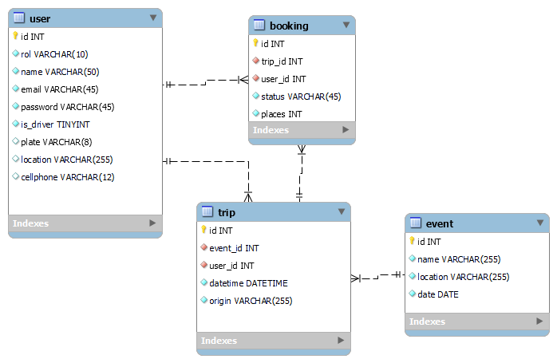

# Rock-Ride

1. Clone the repository
[Repositrio en GitHub](https://github.com/No-Country/c16-115-n-javascript.git)

2. Create a copy of `.env.template` and rename it to `.env` and change the environment variables.

3. Install dependencies `npm install`

Backend Rock-Ride

### Diagrama de la Base de Datos

